# File Upload Vulnerability

File Upload Vulnerability — web siteda foydalanuvchi yuklayotgan fayllarning turi, kengaytmasi yoki tarkibi yetarli darajada tekshirilmaganda kelib chiqadigan zaiflik turi.

Noto'g'ri validatsiya orqali hujumchi PHP kabi server-side fayllarni yuklashi ularni serverda bajartirishi va natijada Remote Code Execution (RCE)gacha borishi mumkin.

Ushbu laboratoriyalarda Burp Suite yordamida file upload himoyalarini turli usullar bilan chetlab o'tib, serverdagi Carlos secret qiymatini olish sinab ko'rildi.

## Bu labaratoriyada File upload zaifliklari ko'rib chiqildi:
Unrestricted File Upload - PHP web shell yuklash va RCE olish.
Flawed File Type Validation - `Content-Type` orqali fayl turini tekshirishni chetlab o‘tish.
Path Traversal orqali File Upload - faylni boshqa katalogga chiqarib, PHP sifatida bajarish.
`.htaccess` orqali bypass — Apache konfiguratsiyasini o'zgartirib, `.l33t` faylini PHP sifatida bajarish.
File Extension Obfuscation — `%00`, qo'shimcha extension va boshqa filename manipulyatsiyalari orqali blacklistni chetlab o'tish.
File Upload Race Condition — validatsiya va faylni o'chirish orasidagi vaqt oralig'idan foydalanish.

# 1-Lab - Unrestricted File Upload

Ushbu labda profil rasmi yuklash funksiyasidagi Unrestricted File Upload zaifligi tekshirildi. Serverga PHP fayl yuklandi va u server tomonidan bajarildi.

Veb site orqali profil rasmi uchun .jpeg rasm yuklandi:

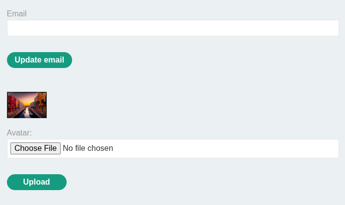

Burp Suite HTTP History yordamida Get so'rovi olinib Repeatorga tahrirlash uchun yuborildi va shell.php file yaratilib yuklandi, server PHP fileni qabul qildi.
shell.php file kodi:
```<?php echo file_get_contents('/home/carlos/secret'); ?>```

Keyin Burp Repeater orqali quyidagi request yuborildi:
`.jpeg` rasmning Get so'rovidagi `image.jpeg`ni tahrirlab shell.php ga o'zgartirib yuborildi.

```GET /files/avatars/exploit.php```

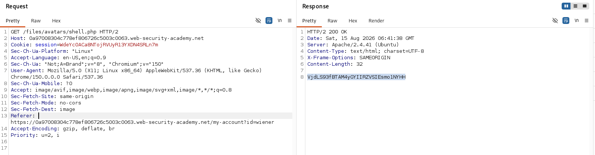

Server php kodni execute qildi va response ichida /home/carlos/secret flagni chiqardi.


# 2-Lab — Web Shell Upload via Content-Type Restriction Bypass

Bu labda fayl yuklash funksiyasida faylni o'zini o'zgartirmasdan, Content-Type headeri orqali validatsiya qilindi. Noto'g'ri MIME type berish orqali PHP web shellni yuklandi va serverda bajarildi.
1-bo'lib oddiy `.jpeg` rasm yuklandi va Get so'rovi Burp repetatorga yuborildi
Endi shell.php file yaratilib uni yuklab ko'rildi lekin server `image/jpeg` va `image/png` rasmlarga ruxsat berilgani aniqlandi.

Burp Suite HTTP history orqali `POST /my-account/avatar` requesti topildi va Burp Repeaterga yuborildi.
So'rovda `Content-Type: application/x-php` ni `Content-Type: image/jpeg`ga o'zgartirildi.

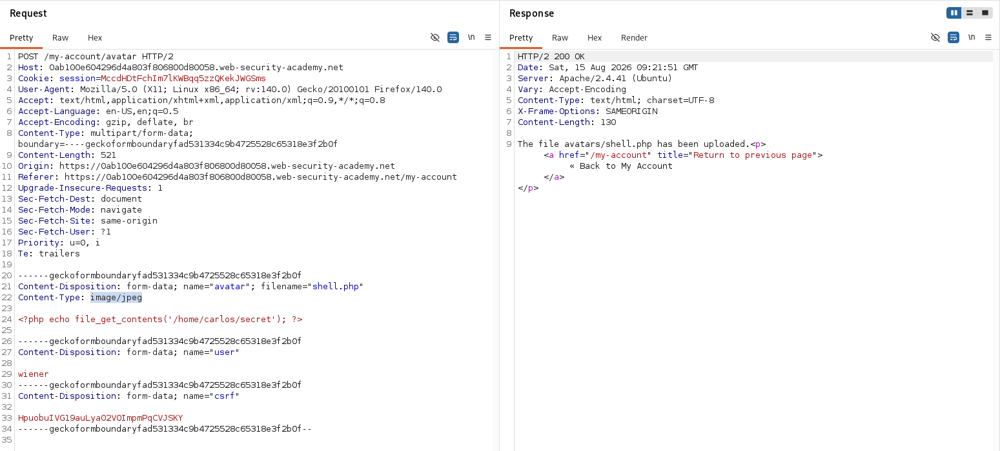

Request yuborilgandan keyin file cheklovlarsiz yuklandi.
Keyin Burp Repeaterdagi GET requestda fayl nomi shell.php qilib o‘zgartirildi:

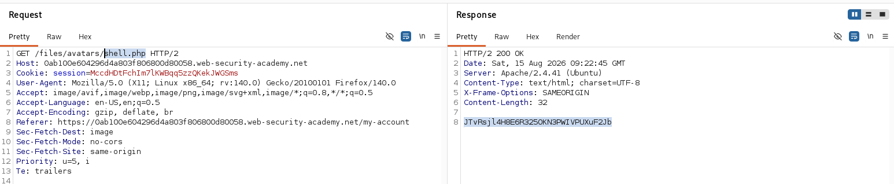

Server php fileni bajarib, respoce orqali secret qiymatni qaytardi.


# 3-Lab — Web Shell Upload via Path Traversal

Ushbu labda server PHP fayllarini to'g'ridan-to'g'ri bajarishni cheklagan. Ushbu cheklovni Path Traversal orqali chetlab o'tildi, PHP web shellni boshqa katalogga joylashtirildi va bajarildi.

Oddiy rasm yuklandi, Burp suite HTTP History yordami Get so'rovi olindi.

Exploit:
Shell.php file yaratildi.
kodi:
```<?php echo file_get_contents('/home/carlos/secret'); ?>```
PHP fayl yuklandi lekin uni to'g'ridan-to'g'ri chaqirganda server PHP kodini plain text sifatida qaytardi.
Keyin POST /my-account/avatar requesti Burp Suite Repeater ga yuborildi va filename `..%2fshell.php` o'zgartirildi.

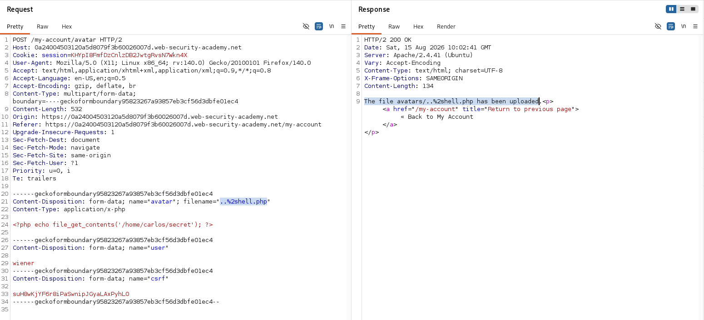

Bu orqali file avatars katalogidan yuqoridagi /files katalogiga joylashtirildi.

Get requesti shell.php uchun yuborildi : `GET /files/shell.php`

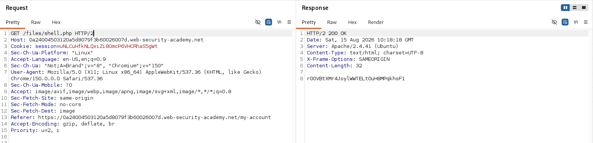


# 4-Lab — Web Shell Upload via Extension Blacklist Bypass

Ushbu labda .php fayllarini yuklashga qo'yilgan blacklist cheklovini .htaccess orqali chetlab o'tildi va .php file bajarildi.
Oddiy rasm yuklandi, Burp suite HTTP History yordami Get so'rovi olindi.

Exploit:
shell.php file yuklandi lekin blacklist `.php`ga ruxsat bermadi.
Burp Repeater orqali upload requesti o'zgartirilib, `.htaccess` file yuklandi. Uning ichiga quyidagi Apache konfiguratsiyasi yozildi:

```AddType application/x-httpd-php .l33t```
Bu konfiguratsiya .l33t fayllarni PHP sifatida bajarishga imkon berdi.

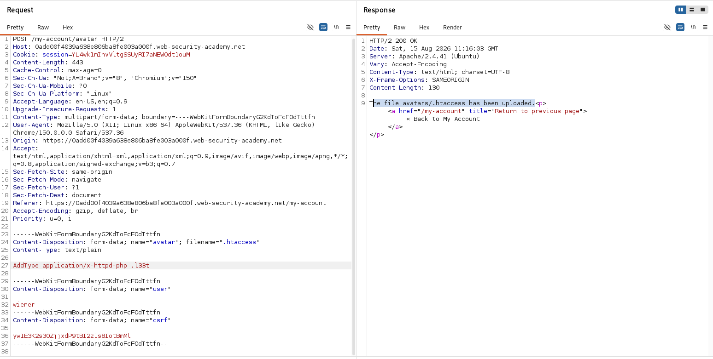

shell.php o'rniga shell.l33t nomi bilan yuklandi va file cheklovlarsiz serverga yuklandi.

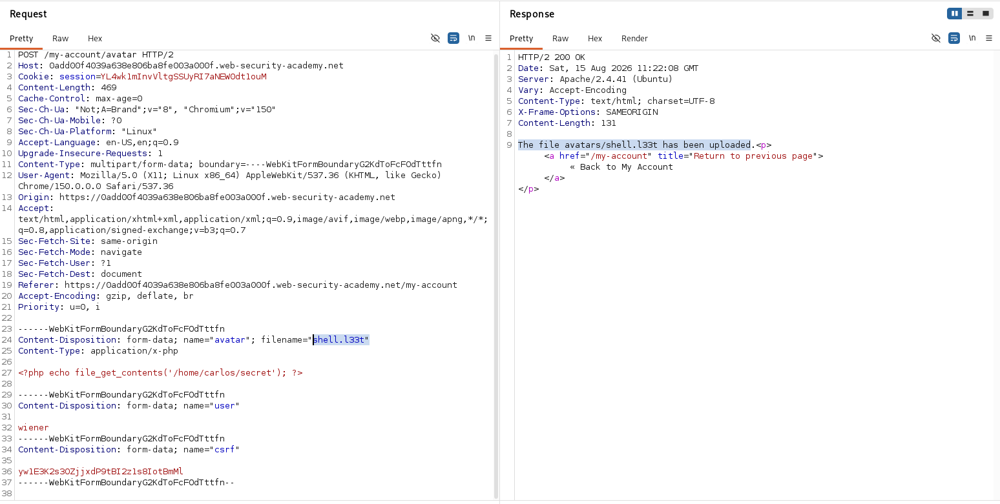

Keyin Get requesti `GET /files/avatars/shell.l33t` ko'rinishda o'zgartirilib yuborildi.

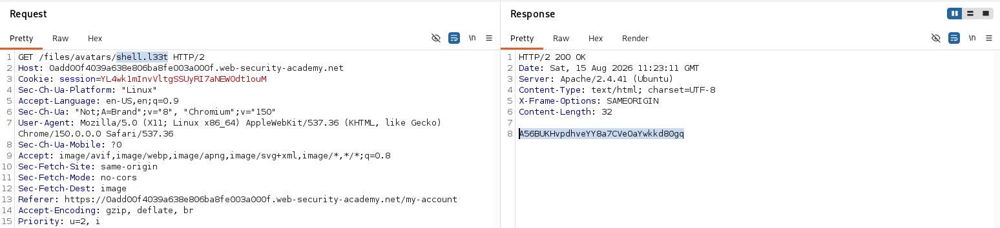

Server .l33t ni bajarib secret qiymatni yubordi.

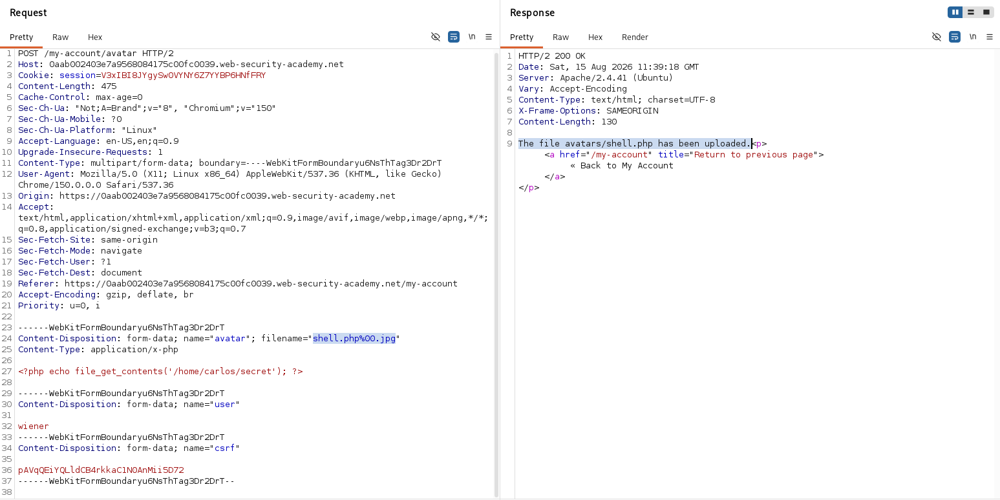

# 5-Lab — Obfuscating File Extensions

Bu labda .jpg va .png fayllargagina ruxsat beruvchi validatsiyani URL-encoded null byte (%00) orqali chetlab o'tildi va PHP file serverda bajarildi.
Oddiy rasm yuklandi, Burp suite HTTP History yordami Get so'rovi olindi.
php file yuklab ko'rildi, lekin server faqat JPG va PNG filelarga ruxsat berdi.
Burp Repeater orqali `POST /my-account/avatar` requesti o'zgartirilib.
filenamega `exploit.php%00.jpg` null byte va .jpg qo'shildi va file serverga yuklandi.


Keyin Burp Repeater bilan request yuborildi:

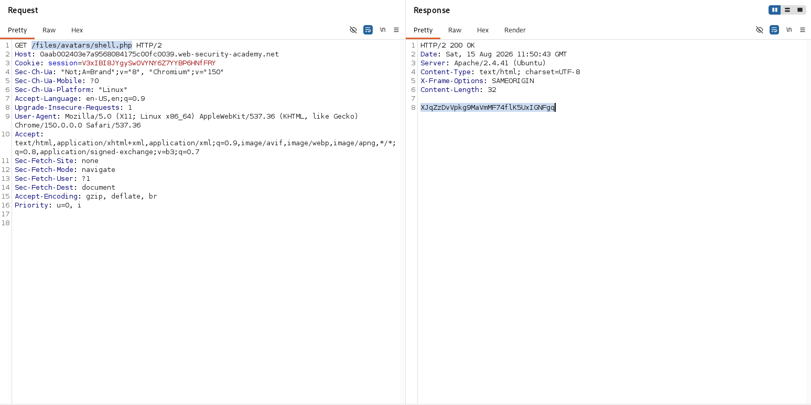

Server PHP fileni bajardi va secret qiymatini chiqardi.


# 6-Lab — Remote Code Execution via Polyglot Web Shell Upload

Ushbu labda faylning haqiqiy tarkibini tekshirishga asoslangan himoyani chetlab o'tildi, JPEG fayl ichiga PHP kodini joylashtirib polyglot web shell yaratildi va serverda bajarisldi.
Oddiy PHP faylni yuklanganda server fayl tarkibini tekshirgani uchun faylni image sifatida qabul qilmadi.
Shundan keyin JPEG formatidagi faylga PHP payload joylashtirilib, polyglot file yaratildi. Fayl JPEG sifatida ko'rinsaham ichida PHP kodini kirgizildi.

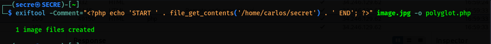

Tayorlangan file yuklandi va server uni qabul qildi.
Keyin yuklangan faylga Burp Repeater orqali jo'natildi. Server faylni qayta ishlayotganda PHP payloadni bajardi va secret qiymatini responseda qaytardi.

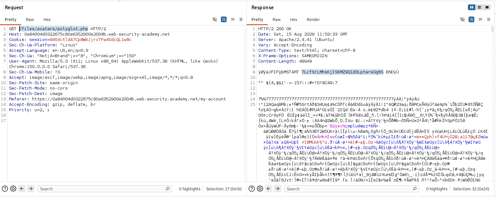

# 7-Lab — Exploiting File Upload Race Conditions
Ushbu labda fayl yuklash va validatsiya orasidagi race conditiondan foydalanib, PHP faylni qisqa vaqt ichida ishga tushirib ko'rildi.
Oddiy rasm yuklandi, Burp suite HTTP History yordami Get so'rovi olindi.
PHP fayli yuborildi va server tomonidan bloklandi.
Race conditionni ushlash uchun Turbo Intruder ishlatildi. POST orqali PHP fayl yuklanishi bilan bir vaqtda unga GET requestlar yuborildi.
```
engine.queue(request1, gate='race1')

for x in range(5):
    engine.queue(request2, gate='race1')

engine.openGate('race1')
```
Bunda request1 - faylni yuklash requesti, request2 esa yuklangan PHP faylga murojaat qiluvchi GET requesti.

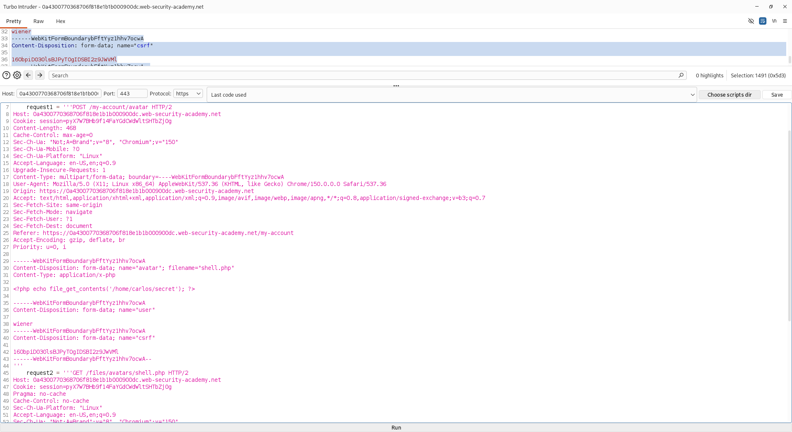

Requestlardan biri file tekshirilib o'chirishdan oldin php file bajardi. 

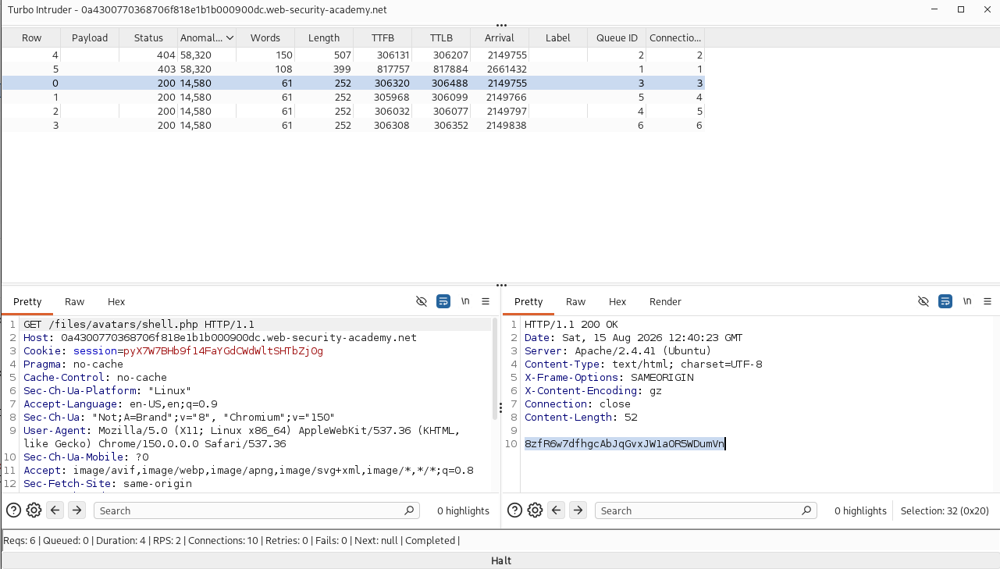

