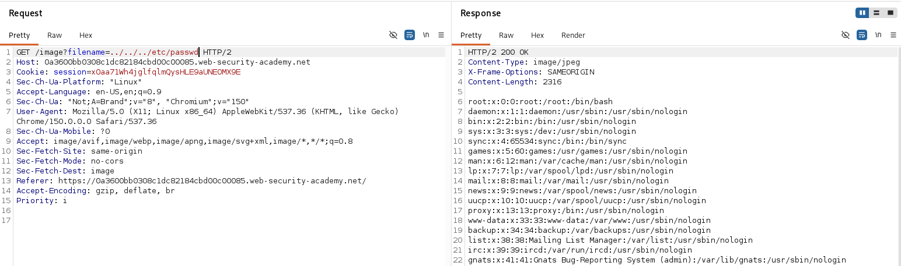
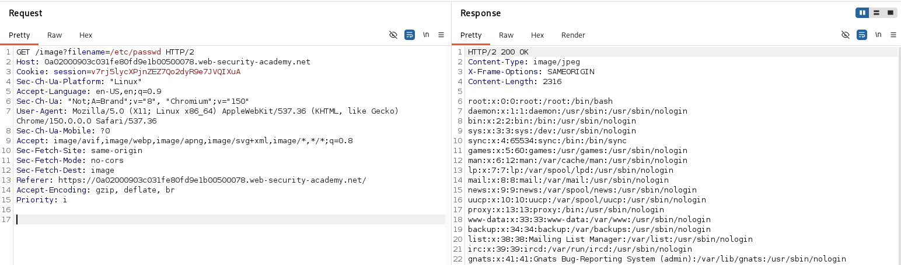
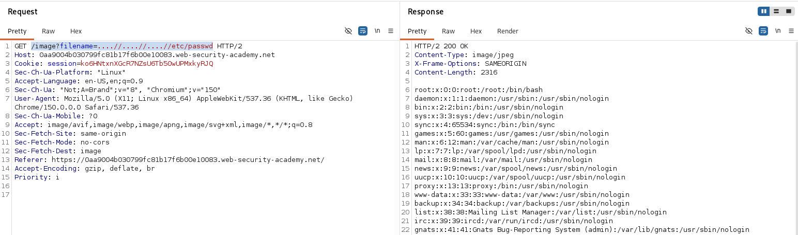
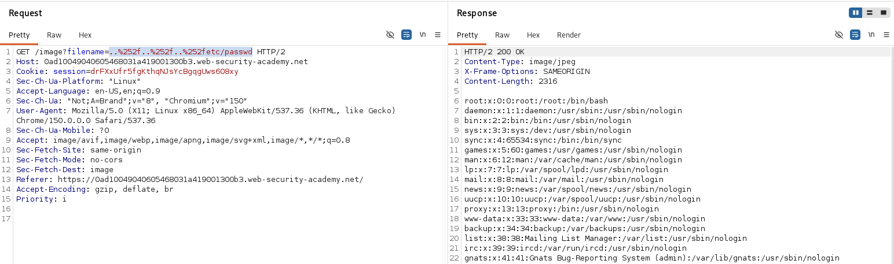
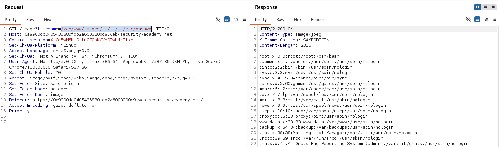
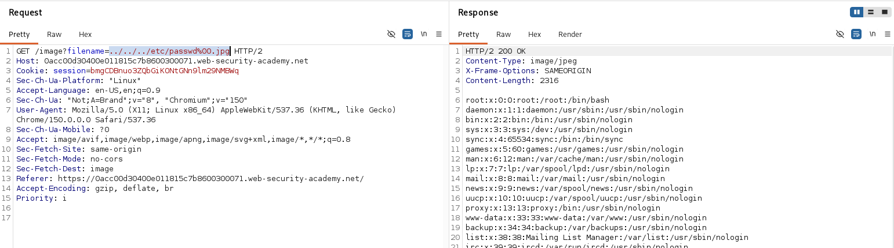

Path Traversal — web-ilovadagi zaiflik hisoblanadi u hujumchiga serverdagi ruxsatsiz fayllarga murojaat qilish imkonini beradi.
Natijada hujumchi:
serverdagi maxfiy fayllarni o‘qishi;
konfiguratsiya va credentiallarni olishi;
ayrim holatlarda fayllarni o‘zgartirishi mumkin.

# File path traversal, simple case
Burp proxy yordamida filename request ushlanib repeatorga yuborildi.
Repeator orqali request ../../../etc/passwd ga o'zgartirilib serverga yuborildi va server malumotlarni qaytardi.

# File path traversal, absolute path bypass
Burp porxydan filename parametrli request olinib repeatorga yuborildi va tekshirildi. Server ../ ni blokladi lekin /etc/password orqali kirildi.

# File path traversal, traversal sequences stripped non-recursively
Burp Proxy yordamida filename request ushlanib, Repeaterga yuborildi.Repeater orqali filename parametri ....//....//....//etc/passwd qiymatiga o'zgartirilib, serverga yuborildi. Server traversal ketma-ketligini faqat bir marta filtrlashi sababli payload ../../../etc/passwd ga aylandi, server /etc/passwd fayli tarkibini qaytardi.

# File path traversal, traversal sequences URL-encoded
Burp Proxy yordamida filename request ushlanib, Repeaterga yuborildi.
Repeater orqali filename parametrini URL encoding qilib  ..%252f..%252f..%252fetc/passwd qiymatiga o'zgartirildi va serverga yuborildi. Server URL-decode qilib payloadni ../../../etc/passwd ko'rinishida qayta ishladi va /etc/passwd fayli tarkibini qaytardi.

# File path traversal, validation of start of path
Burp Proxy yordamida filename request ushlanib, Repeaterga yuborildi. 
Repeater orqali filename parametri /var/www/images/../../../etc/passwd qiymatiga o'zgartirilib, serverga yuborildi. Kiritilgan yo'l /var/www/images bilan boshlangani uchun tekshiruvdan o'tdi va /etc/passwd qiymatini qaytardi.

# File path traversal, validation of file extension with null byte bypass
Burp Proxy yordamida filename request ushlanib, Repeaterga yuborildi.
Server faqat .jpg filelarni qabul qilishi aniqlandi, buni chetlab o'tish uchun null byte(%00)dan foydalanildi. Filename parametri ../../../etc/passwd%00.png ga o'zgartirilb yubirildi, server /etc/passwd qiymatini qaytardi.

